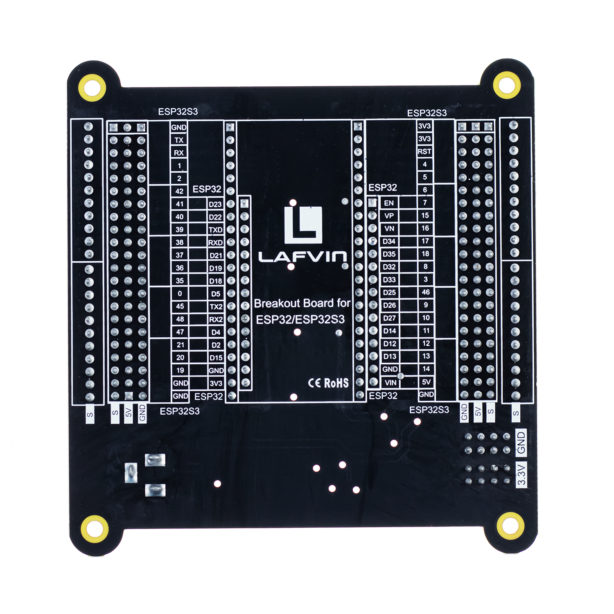
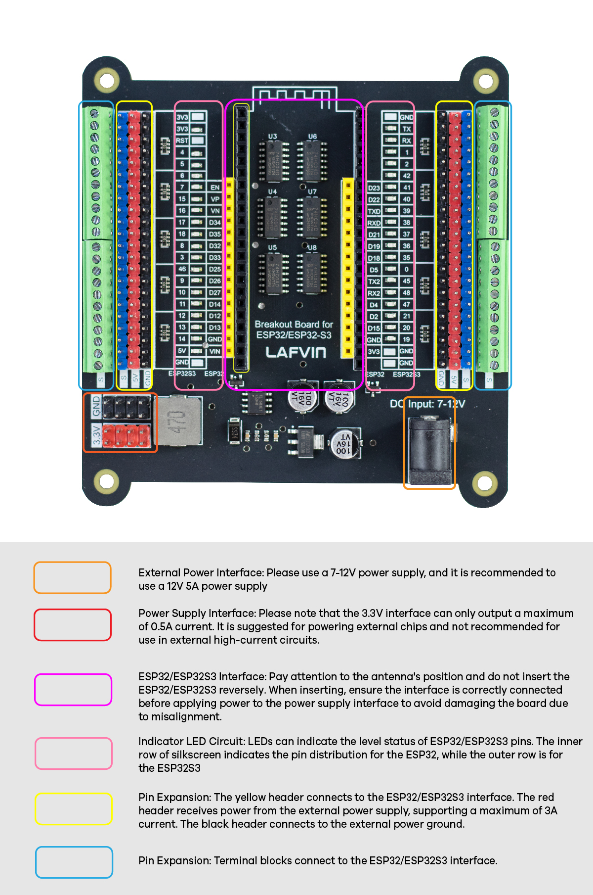

.. __about_this_kit:

About_this_kit
====================

Preface
-------------------------------

Breakout Board for ESP32/ESP32S3 Before we understand the ESP32 breakout board,we need to first understand it.The following figure is a schematic diagram of the 
ESP32/ESP32_S3 breakout board:

.. figure:: ./Tutorial/img/正面.jpg
   :align: center
   :width: 70%
   

The hardware interfaces :   
-------------------------------

Note
-------------------------------

1. The  Breakout Board for ESP32 supports both the  ESP32 and  ESP32S3 boards.Please pay attention to the orientation of the ESP32 board when using it. Inserting itincorrectly or misaligning it couldlead to board damage.
2. The 5V is powered by the DC jack, and it supports a maximum ourput current of 3A. 
3. The S terminal directly connects to the ESP32 board, with a levelrange of 0-3.3V. Most electronic modules in the market apply TTL signals, with some powered by 3.3V and others by 5V. According to the TTL Logic Levels, the range of high level is 2-5V and low ranges from 0 to 0.8V. Therefore, even if a 5V device is used,it can still be driven by the pinsof the S Terminal. However, if level conversion chip is added to the circuit, it will cause malfunction to the 3.3V devices.
4. The power supply of the 3.3V pins depends on whether you connect power supply to USB or DC jack.
5. During use, if the pin is NC, the corresponding LED indicator will light up or go out randomly.
6. If you find that some LEDs are not controlled, please first check whether the pin is an input pin. The LED indicator can only indicate the status of the output.

Safety and Precautions :
-------------------------------
Please follow the following safety precautions when using or storing this product:

1. Keep this product out of the reach of children under 6 years old.
2. This product should be used only when there is adult supervision present as young children lack necessaryjudgment regarding safety and the consequences of product misuse.
3. This product contains small parts and parts, which are sharp. This product contains electrically conductive parts. Use caution with electrically conductive parts near or around power supplies, batteries and powered (live) circuits.
4. When the product is turned ON, activated or tested, some parts will move or rotate. To avoid injuries to hands and fingers, keep them away from any moving parts!
5. It is possible that an improperly connected or shorted circuit may cause overheating. Should this happen, immediately disconnect the power supply or remove the batteries and do not touch anything until it cools down! When everything is safe and cool, review the product tutorial to identify the cause.
6. Only operate the product in accordance with the instructions and guidelines of this tutorial, otherwise parts may be damaged or you could be injured.
7. Store the product in a cool dry place and avoid exposing the product to direct sunlight.
8. After use, always turn the power OFF and remove or unplug the batteries before storing.

Componen List
-------------------------------

1.5 mm flathead screwdriver × 1

ESP32-Breakout Board*1

   .. image:: /Tutorial/img/组件.jpg

Compatible motherboards
-------------------------------

.. role:: red
   :class: red

:red:`The ESP32 breakout board is compatible with a variety of ESP32 series main control boards with different modules. The method to determine whether it is compatible is to compare the number, position （Include the distance between pins in the same row and the distance between pins in different rows） and name of the pins`

   .. image:: /Tutorial/img/间距判断.jpg

 *ESP32 DEVKIT V1 Board*

   .. image:: /Tutorial/img/32兼容.jpg

 *ESP32_S3 Board*

   .. image:: /Tutorial/img/S3兼容.jpg

.. raw:: html
   .longtable td {
     padding: 8px;
   }
   </style>

   <style>
   .red {
     color: red;
     font-weight: bold;
   }
